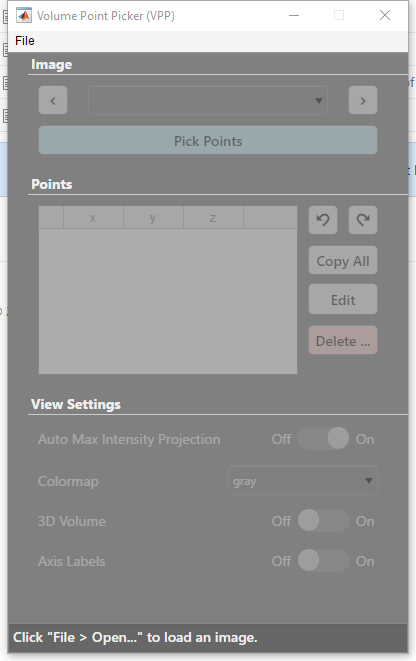
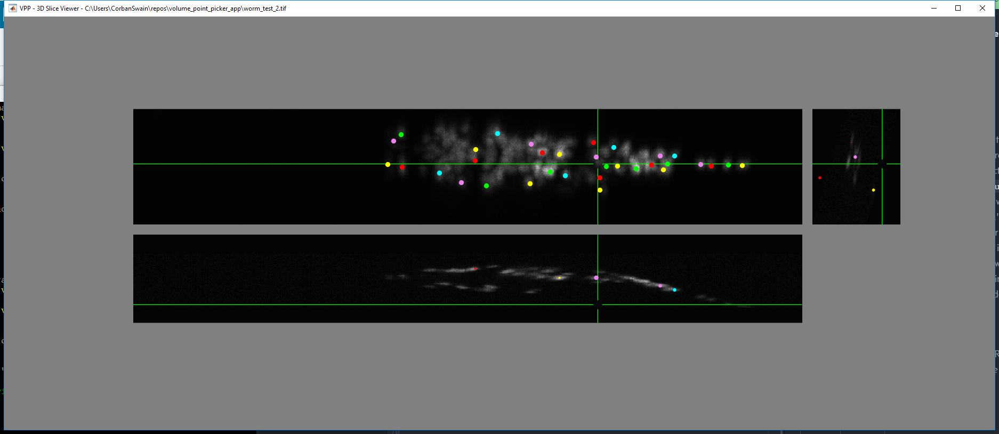

# Volume Point Picker [0.0.2]

*A MATLAB-based application for selecting and annotating points in 3D
volumetric images.*

* **This project is in active development. It will be buggy! Please let me know
of any issues or suggestions you have while using it.**
* Readme Last Updated: October 19, 2018
* Author: Corban Swain

## Getting Started

1. Clone or download this repository by clicking the green button on the top of
[this repos's GitHub page](https://github.com/CorbanSwain/Volume-Point-Picker).
Let's say the repo is now in a directory named `VPP`.
1. Open MATLAB and change the working directory to `VPP`.
(See [compatibility](#compatibility))
1. In the MATLAB command window type `VolumePointPicker` and press enter.
This will open the Volume Point Picker application window.
1. In the application window click 'File > Open...', then navigate to a `.tif`
image stack file and open it. The interactive volume viewer window should now
open.
1. Move your mouse over one of the projections in the interactive volume viewer
and click on a point of interest. This will constrain the two axes in the plane
of the projection.
1. Click a second time to lock in and save the point. You are now on your way
to annotating volume images! See more information in the documentation.

## Compatibility
This software has only been validated in MATLAB R2017b. *Let me know what
MATLAB releases work for you and the following table can be periodically
updated.*

| Release | Status    |
| ------- | --------- |
| Later   | *Unknown* |
| R2017b  | Running   |
| Earlier | *Unknown* |

## Features

*A listing of the existing and planned features for the VPP app. Features which
have a working implementation are indicated with a* ✅. *Feel free to raise a
GitHub issue to suggest additional features.*

#### File Handling

- [x] Load in `.mat` files.
- [x] Load in `.tif` files.
- [x] Load in `.nii` files.
- [ ] Save an annotation session so it can be reopened at a later time.
- [ ] Load in a past annotation session.
- [ ] Open multiple images for annotation at once.

#### Interactive Image Viewing and Annotation

- [x] Show the three orthogonal maximum intensity projections of the volume.
- [ ] Label the appropriate axes on each of the orthogonal projections
- [x] Update the pointer location in real time based on the mouse location over
each of the orthogonal views.
- [x] Allow for the scroll wheel to control the free dimension when the mouse
is over a projection.

#### Image Annotation

- [x] Dynamically resize annotation points based on distance from the centroid
to the current slice plane to simulate a sphere.
- [x] Display a table with the values of the annotated points.
- [ ] Undo and Redo functionality for annotation actions
- [ ] Ability to edit annotated points
- [x] Automatic coloring of annotation points based on distance
- [ ] Ability to select give an annotated point a specific color

#### Annotation Export

- [x] Real-time export of annotated points to workspace variables.
- [x] Ability to copy the annotated points to the clipboard.
- [ ] Save annotated points directly to a `.mat` file.

## Non-Feature To-dos

- [ ] Add application documentation
- [ ] Add documentation to all functions
- [x] Add Readme to project

## Screenshots

#### Main Volume Point Picker application window after startup

#### Interactive Volume Viewer with selected points in C. elegans image.

